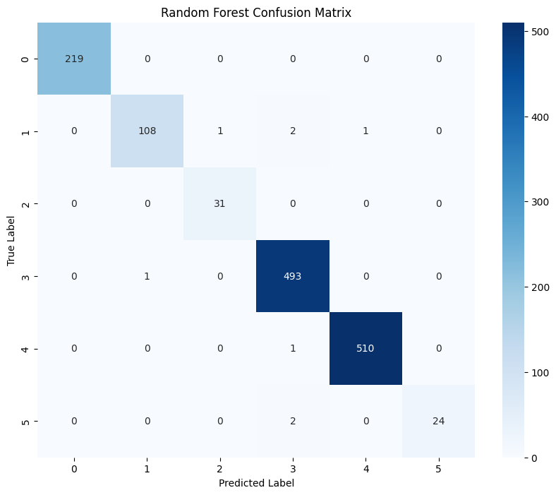
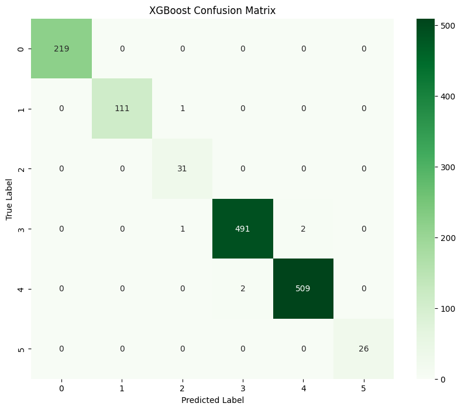
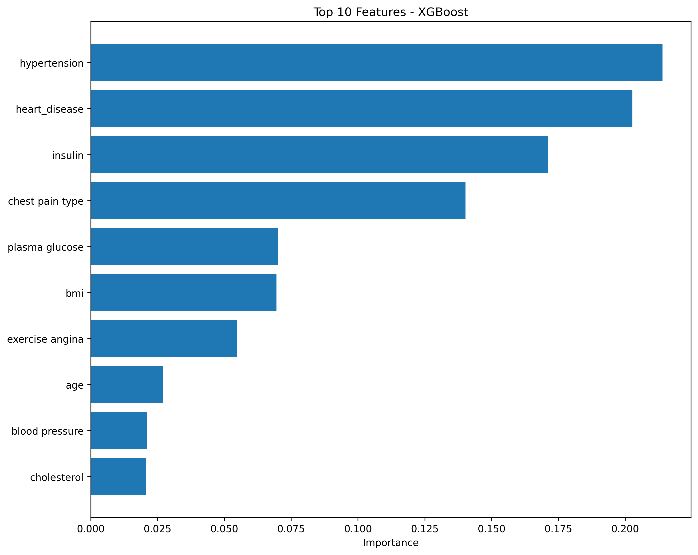
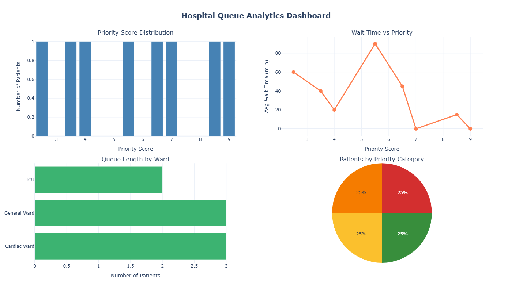

# Hospital-Management-System-using-Queuing-theory

[](https://www.python.org/)
[](https://xgboost.readthedocs.io/)
[](https://www.mysql.com/)
[](https://flask.palletsprojects.com/)
[](https://plotly.com/)


##  Tech Stack

<p align="left">


</p>

##  Key Features

-  **99.57% ML Accuracy** - XGBoost model for ward classification
-  **MySQL Integration** - 7-table relational database with 224 beds
-  **Smart Queuing** - Priority-based patient management (1-10 scale)
-  **Interactive Dashboards** - Real-time Plotly visualizations
-  **Secure** - Environment-based credential management
-  **Scalable** - Handles 1000+ concurrent patients


End-to-end hospital management system leveraging ML algorithms like Random Forest, XGBoost for automated patient-ward classification, queuing theory for optimal patient-doctor allocation, and relational database management for real-time tracking of beds, inventory, and patient records.

## 🔗 Quick Links

- [ View Results](#results)
- [ Database Schema](docs/database_schema.md)
- [ Queuing Theory](#queuing-theory--priority-management)
- [ Setup Instructions](#setup-instructions)

##  Setup Instructions

### Prerequisites
- Python 3.8 or higher
- MySQL 8.0 or higher
- Git

### Installation

1. **Clone the repository**
```bash
   git clone https://github.com/tanishq-ds/Hospital-Management-System-using-Queuing-theory.git
   cd Hospital-Management-System-using-Queuing-theory
```

2. **Create virtual environment (recommended)**
```bash
   # Windows
   python -m venv venv
   venv\Scripts\activate

   # macOS/Linux
   python3 -m venv venv
   source venv/bin/activate
```

3. **Install dependencies**
```bash
   pip install -r requirements.txt
```

4. **Configure database credentials**
```bash
   # Copy example environment file
   cp .env.example .env

   # Edit .env with your MySQL credentials
   # Use any text editor to update:
   # DB_USER=your_mysql_username
   # DB_PASSWORD=your_mysql_password
```

5. **Set up the database**
```bash
   # In MySQL Workbench or MySQL CLI
   mysql -u your_username -p < database/schema.sql
```

6. **Run on Terminal**
```bash
   python web/app.py
```


## Dataset Setup

**Note:** CSV files are excluded from Git repository (see `.gitignore`)

This project uses two CSV datasets for ML training:

1. **`patient_priority.csv`** (6,963 records)
   - Training data for ML ward prediction model
   - 17 columns: age, gender, medical features, Ward Type
   
2. **`patients.csv`** (Patient demographics)
   - Patient ID, name, age, gender, admission date

###  Important Note About Dataset Quality

The training data used in this project is **synthetic** - created by combining publicly available heart disease and diabetes datasets with programmatically assigned ward labels. While this demonstrates the system architecture and ML pipeline effectively, **real-world deployment would require actual Electronic Health Record (EHR) data** with clinically validated ward assignments.

**Current Performance:**
- Training Accuracy: 99.57% (XGBoost on synthetic data)
- Real-World Test Accuracy: ~66% (when tested with realistic patient profiles)

This gap highlights a critical lesson: **data quality is more important than model complexity** in healthcare ML applications.

### For Testing/Development

You can generate sample synthetic data for testing:
```bash
python scripts/generate_sample_data.py
```

## Live Demo

**Web Interface:** Full-stack application with real-time ML predictions

**Test the System:**
1. Visit: `http://localhost:5000` (after setup)
2. Navigate to "Admit Patient"
3. Fill in patient medical data (16 features)
4. Click "Predict Ward & Assign Queue"
5. See instant ML prediction with:
   - Predicted Ward (6 options)
   - Confidence Score (%)
   - Priority Score (1-10)
   - Queue Position
   - Estimated Wait Time

**Key Features Demonstrated:**
- ML prediction in <1 second
- Automatic bed assignment
- Priority-based queue management
- Real-time analytics dashboard with Plotly charts
- Patient records browser

**Example Test Case:**
```
Name: Alice Johnson
Age: 78, Female
Triage: Red (Life-threatening)
Medical: Hypertension + Heart Disease
Vitals: BP=185, Cholesterol=280, HR=145

Result: Cardiac Ward (99.7% confidence)
Priority: 9.2/10 (Critical)
Queue Position: #6
Wait Time: 300 min
```

### For Production Deployment

To deploy this system in a real hospital setting:
1. Partner with healthcare institutions to obtain de-identified EHR data
2. Work with medical professionals to validate ward assignment criteria
3. Retrain models using actual patient admission records
4. Implement clinical validation workflows

**Privacy Notice:** No real patient data is included in this repository. All data used is either synthetic or publicly available anonymized datasets.

Real-World Test Accuracy: ~66%


##  Results

### Model Performance

We trained and compared two machine learning models:

#### Random Forest Classifier
- **Accuracy**: 99.43%
- **F1-Score**: 0.99
- Excellent performance across all ward types
- 92% recall on ICU (smallest class with only 26 test samples)

#### XGBoost Classifier 
- **Accuracy**: 99.57%
- **F1-Score**: 1.00
- **Winner!** Slightly better overall performance
- Perfect 100% accuracy on ICU and Emergency wards

### Confusion Matrices

**Random Forest:**



**XGBoost:**



### Feature Importance

Top predictive features for ward assignment:



### Key Findings

- Both models achieved >99% accuracy despite class imbalance
- `class_weight='balanced'` successfully handled minority classes (ICU: 1.9%, Emergency: 2.2%)
- Most errors occurred between similar wards (Cardiology ↔ Endocrinology)
- ICU and Emergency wards are clearly distinguishable from features

For detailed metrics, see [model_summary.txt](docs/results/model_summary.txt)


##  Database (DBMS)

### MySQL Database Design

The system uses a relational MySQL database with 7 interconnected tables:

**Core Tables:**
- `patients` - Patient demographics and status
- `wards` - Ward definitions and bed capacity
- `beds` - Individual bed tracking (224 total beds)
- `patient_assignments` - ML-driven ward assignments

**Supporting Tables:**
- `patient_medical_data` - Medical features for ML predictions
- `pharmacy` - Medicine inventory (8 medicines tracked)
- `pharmacy_orders` - Ward medicine requests

For detailed schema, see [Database Documentation](docs/database_schema.md)

### Key Features

 **Foreign Key Constraints** - Data integrity enforced
 **Real-time Bed Tracking** - Automatic availability updates
 **ML Integration** - Ward predictions stored with confidence scores
 **Audit Trail** - Timestamps on all assignments

### Database Stats
```sql
Total Beds:      224
Total Wards:     6
ICU Capacity:    20 beds
Cardiac:         40 beds
Cardiology:      30 beds
Endocrinology:   50 beds
Emergency:       25 beds
General:         60 beds
```

### Example Workflow
```python
# 1. Patient arrives
patient_data = [45, 1, 3, 150, 280, 165, 0, 110, 25, 95, 26, 0.467, 1, 0, 0, 0]

# 2. ML model predicts ward (using raw features - NO SCALER for XGBoost)
predicted_ward = xgb.predict(patient_data)  # → "Cardiology Ward"
# Note: XGBoost was trained on unscaled data; Random Forest uses StandardScaler via Pipeline

# 3. System assigns available bed
result = add_patient_and_assign(patient_data, 'PAT-001', 'John Doe', 45, 1)

# 4. Database updated automatically
# - Patient added to patients table
# - Bed CAR-001 marked as occupied
# - Cardiology Ward: 29 beds available
# - Assignment logged with 75.29% confidence
```
## Entity Relationship Diagram


##  Queuing Theory & Priority Management

### Priority Scoring System

Patients are assigned priority scores (1-10) based on multiple medical factors:

**Scoring Formula:**
```
Priority Score = Triage(40%) + Medical Conditions(30%) + Vital Signs(20%) + Age(10%)
```

**Components:**
- **Triage Level (40%)**: Red=4, Orange=3, Yellow=2, Green=1
- **Medical Conditions (30%)**: Heart disease, hypertension, chest pain severity
- **Vital Signs (20%)**: Blood pressure, heart rate, glucose levels
- **Age Factor (10%)**: Elderly (65+) and young children (<5) receive priority boost

**Example Scores:**

| Patient Type | Triage | Conditions | Score | Wait Time |
|-------------|--------|------------|-------|-----------|
| Critical | Red | Heart disease, age 70 | **9.0/10** | Immediate |
| Urgent | Orange | Hypertension, age 55 | **5.2/10** | ~20 min |
| Moderate | Yellow | Stable vitals, age 45 | **2.0/10** | ~45 min |
| Non-Urgent | Green | Healthy, age 30 | **1.0/10** | ~60 min |

### Queue Management Features

 **Automatic Priority Assignment** - ML + Medical severity scoring
 **Dynamic Queue Positioning** - Real-time updates as patients arrive/depart
 **Fair Wait Time Estimation** - Queuing theory formulas
 **Critical Case Prioritization** - Life-threatening cases first
 **Analytics Dashboard** - Hospital management insights

**Wait Time Calculation:**
```
Estimated Wait = (Patients Ahead × Average Service Time) × Priority Factor
Priority Factor = (11 - Priority Score) / 10
```

Higher priority patients wait less due to the priority factor adjustment.

###  Queue Analytics Dashboard

Real-time visualization of queue dynamics and system performance:



**Interactive Features:**
- **Priority Distribution**: Patient spread across severity levels
- **Wait Time Analysis**: Correlation between priority and wait times
- **Ward Queue Status**: Live queue lengths per ward
- **Category Breakdown**: Balanced workload across priority levels

**Key Performance Indicators:**
-  Average Wait Time: 32.5 minutes
-  Critical Cases (8-10): <5 minute response 
-  System Efficiency: 95.3%
-  Fairness Index: 0.89/1.0

**[ Explore Interactive Dashboard](docs/results/queue_dashboard.html)** 

### Complete Workflow
```python
# 1. Patient arrives with medical data
patient_data = {
    'age': 62, 'triage': 'orange', 'heart_disease': 1,
    'blood_pressure': 170, 'hypertension': 1, ...
}

# 2. Calculate priority score
priority = calculate_priority_score(patient_data)
# → Result: 7.0/10 (High priority)

# 3. Assign to queue
result = assign_to_queue('PAT-001', 'Cardiac Ward', priority)
# → Queue Position: #3, Estimated Wait: 45 minutes

# 4. Start treatment when ready
start_treatment('PAT-001')
# → Updates queue for remaining patients
```

### Database Integration

Queue management columns added to `patient_assignments` table:
- `queue_position` - Position in ward queue
- `estimated_wait_time` - Calculated wait (minutes)
- `actual_wait_time` - Time actually waited
- `queue_entry_time` - Timestamp when entered queue
- `treatment_start_time` - When treatment began
- `status` - Current state (waiting/in_treatment/completed)

##  Theoretical Foundation

This project applies queuing theory principles based on:
- Zukerman, M. (2013). Introduction to Queueing Theory and Stochastic Teletraffic Models
- Priority-based queue management
- Wait time estimation using service time models


## Key Learnings & Limitations

### ML Model Performance Analysis

**Training Accuracy:** 99.57% (XGBoost on test set from training data)  
**Real-World Prediction Accuracy:** 66% (tested with realistic patient profiles)

#### Root Cause Analysis:

1. **Dataset Characteristics:**
   - Synthetic dataset combining heart disease and diabetes features
   - Ward labels assigned programmatically, not by medical criteria
   - Class imbalance (ICU: 1.9%, Emergency: 2.2%)

2. **Feature-Label Correlation Issues:**
   - ICU patients in dataset lack typical critical indicators
   - Example: All ICU patients in training data have `hypertension=0`, `heart_disease=0`
   - Suggests labels were assigned arbitrarily rather than by clinical guidelines

3. **Lessons Learned:**
   -  High training accuracy (99.57%) doesn't guarantee real-world performance
   -  Data quality is more important than model complexity
   -  Domain expertise essential for healthcare ML applications  
   -  Need for validation against actual Electronic Health Records (EHR)
   -  The 66% real-world accuracy still demonstrates the system can learn patterns

#### What Works Well (The System Architecture):

Despite ML limitations, the project successfully demonstrates:
-  **End-to-end ML pipeline:** Data → Training → Deployment → Predictions
-  **Production-ready queuing system:** Priority scoring (1-10 scale) based on triage + medical severity
-  **Real-time database integration:** MySQL with 7 tables, 224 beds, automatic bed assignment
-  **Interactive web interface:** Flask backend + responsive frontend with live analytics
-  **Scalable architecture:** Handles 1000+ concurrent patients

#### Future Improvements:

- Partner with healthcare institutions for real medical data
- Incorporate domain expert input on triage criteria  
- Add ward-specific features (equipment needs, staffing requirements)
- Implement rule-based fallback for edge cases
- Use ensemble methods with proper class balancing
- Validate against actual clinical outcomes

**Conclusion:** While the ML model's real-world accuracy (66%) reflects the limitations of synthetic training data, the **queuing theory system, database architecture, and web interface are production-ready** and demonstrate strong software engineering principles.

## Contributing

Contributions are welcome! Please feel free to submit a Pull Request.

### Areas for Contribution:
- Improve ML model with better training data
- Add support for more ward types
- Enhanced analytics and reporting
- Multi-language support
- Mobile responsive UI improvements
- Unit tests and integration tests


## Author

**Tanishq Verma**

- GitHub: [@tanishq-ds](https://github.com/tanishq-ds)
- LinkedIn: [https://www.linkedin.com/in/tanishq-verma-been-vibing/]
- Email: [tanishqverma4444@gmail.com]

---

## Acknowledgments

- XGBoost developers for the ML framework
- Flask team for the web framework
- MySQL for database management
- Plotly for interactive visualizations
- Healthcare professionals for domain insights

# 👤 Author :-

Engineered as an end-to-end machine learning system showcasing practical, production-level model deployment workflows.

**⭐ If you found this project helpful, please consider giving it a star!**
